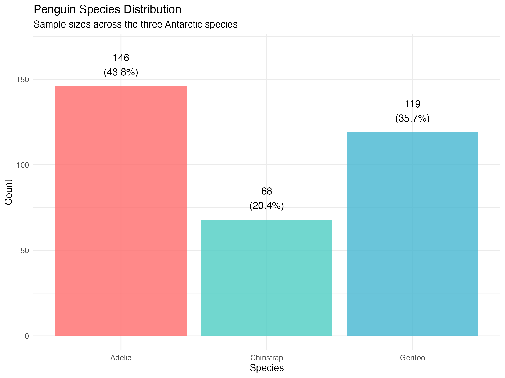
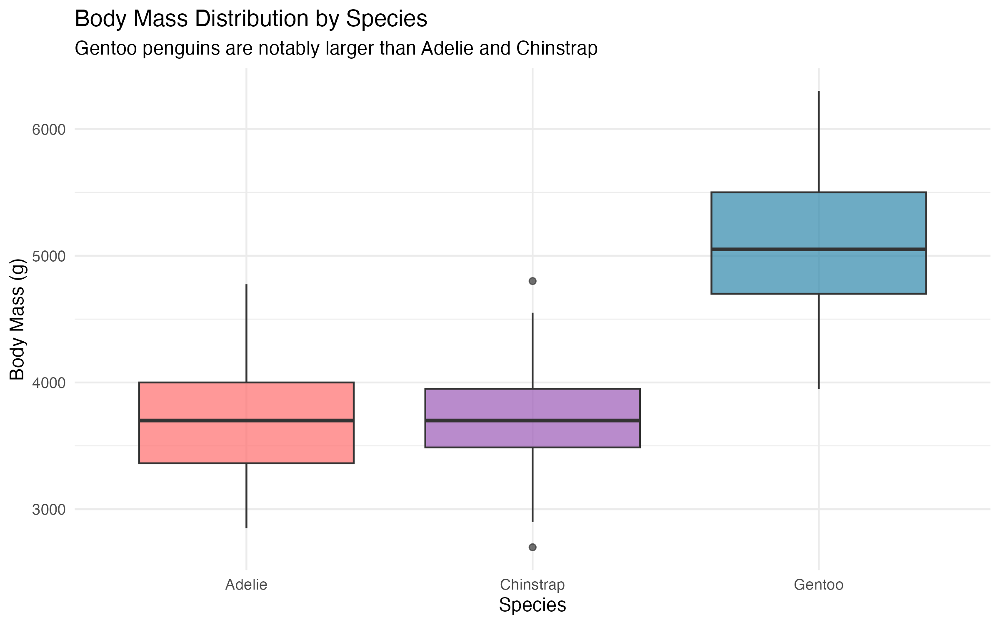
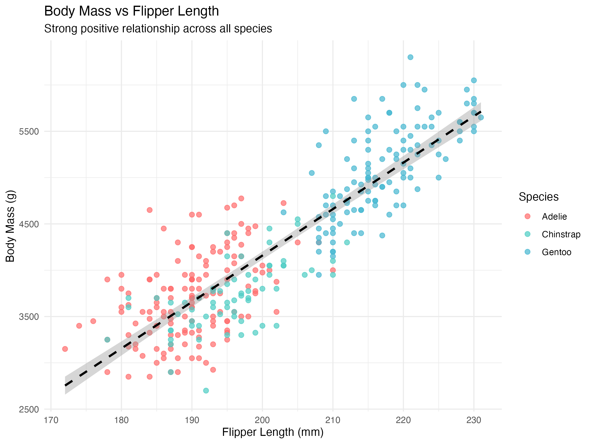

## Course Information

- **Instructor**: Dr. Ronald G. Thomas
- **Email**: rgthomas@ucsd.edu
- **Office Hours**: by appointment
- **TA**: Man Luo
- **TA Email**: maluo@ucsd.edu

## Lecture 5: Analysis Plans and Project 1 {.subtitle}

## Today's Agenda

1. What is a Statistical Analysis Plan (SAP)?
2. Essential Elements of an Analysis Plan
3. Introduction to Project 1: Palmer Penguins
4. The Palmer Penguins Dataset
5. Sample Analysis Plan for Project 1

::: {.fragment .question}
**Question:** Have you ever started an analysis and realized
partway through that you were unsure what question you were
trying to answer?
:::

::: {.fragment .answer}
**Answer:** "In my first consulting project, I spent two weeks
building models before realizing the client wanted descriptive
statistics, not predictions. A clear analysis plan would have
prevented that wasted effort."
:::

# Part I: Statistical Analysis Plans

## What is a Statistical Analysis Plan?

A **Statistical Analysis Plan (SAP)** is a document that specifies:

- The research questions to be addressed
- The statistical methods to be used
- How results will be presented
- Decisions made *before* seeing the data

:::{.callout-note}
The SAP is written before conducting the analysis. It prevents
data dredging and documents your analytical intentions.
:::

::: {.fragment .question}
**Question:** Why is it important to write the plan before
looking at the data?
:::

::: {.fragment .answer}
**Answer:** "Writing the plan first prevents confirmation bias
and p-hacking. If you decide methods after seeing data, you might
unconsciously choose approaches that give significant results."
:::

## Why Analysis Plans Matter

**Professional importance:**

- 72.3% of biostatisticians rate SAPs as "absolutely essential"
- Required for FDA submissions and clinical trials
- Expected in peer-reviewed publications

**Practical benefits:**

- Forces clear thinking about objectives
- Facilitates team communication
- Reduces analytical "wandering"
- Creates audit trail for reproducibility

::: {.fragment .question}
**Question:** How does an analysis plan help in team settings?
:::

::: {.fragment .answer}
**Answer:** "The plan serves as a contract between team members.
Everyone knows what analyses will be performed. When statistician
and PI agree upfront, there are no surprises when results arrive."
:::

## Elements of an Analysis Plan

::: {.plan-element}
**1. Introduction and Background**

- Study context and motivation
- Research questions or hypotheses
- Brief literature context
:::

::: {.plan-element}
**2. Data Description**

- Data source and collection methods
- Study population and sample
- Key variables (outcomes, predictors, covariates)
:::

::: {.fragment .question}
**Question:** How much detail should appear in the plan vs. the
final report?
:::

::: {.fragment .answer}
**Answer:** "The plan describes what you *expect* and how you will
handle it. The report describes what you *observed*. Plan: 'missing
values handled by imputation.' Report: '11 of 344 were imputed.'"
:::

## Elements of an Analysis Plan (continued)

::: {.plan-element}
**3. Statistical Methods**

- Descriptive statistics to be computed
- Primary analysis methods
- Secondary/sensitivity analyses
- Handling of missing data
- Significance level and multiple testing
:::

::: {.plan-element}
**4. Results Presentation**

- Tables to be generated
- Figures to be created
- How effect sizes will be reported
:::

::: {.fragment .question}
**Question:** Should the plan specify exact table shells?
:::

::: {.fragment .answer}
**Answer:** "Yes. Table shells force you to think through exactly
what you will report. They also identify gaps---if you cannot fill
a cell, you may be missing a variable. In trials, shells are required."
:::

# Part II: Palmer Penguins Dataset

## Meet the Palmer Penguins

:::: {.columns}

::: {.column width="55%"}
- Data from **Palmer Station, Antarctica**
- Three species: Adelie, Chinstrap, Gentoo
- Measurements: bill, flipper, body mass
- Collected by Dr. Kristen Gorman (2007--2009)

:::{.callout-note}
The palmerpenguins dataset is an excellent teaching
alternative to the classic iris dataset.
:::
:::

::: {.column width="45%"}
{width="95%" fig-align="center"}
:::

::::

::: {.fragment .question}
**Question:** Why might penguins be preferable to iris?
:::

::: {.fragment .answer}
**Answer:** "Iris has problematic historical associations and
unrealistic properties. Penguins have real ecological context,
meaningful missing data, and realistic variable behavior."
:::

## Dataset Structure

**344 observations, 8 variables:**

| Variable | Type | Description |
|----------|------|-------------|
| `species` | Factor | Adelie, Chinstrap, Gentoo |
| `island` | Factor | Biscoe, Dream, Torgersen |
| `bill_length_mm` | Numeric | Bill length (mm) |
| `bill_depth_mm` | Numeric | Bill depth (mm) |
| `flipper_length_mm` | Numeric | Flipper length (mm) |
| `body_mass_g` | Numeric | Body mass (g) |
| `sex` | Factor | Female, Male |
| `year` | Integer | 2007, 2008, 2009 |

::: {.fragment .question}
**Question:** Which variable is typically the primary outcome?
:::

::: {.fragment .answer}
**Answer:** "Body mass indicates penguin health and condition.
Flipper length, bill dimensions, and species are natural predictors.
However, classification analyses use species as the outcome."
:::

## Species Characteristics

:::: {.columns}

::: {.column width="50%"}
{width="95%" fig-align="center"}
:::

::: {.column width="50%"}
**Key observations:**

- Gentoo are substantially larger
- Adelie/Chinstrap similar mass
- Species differ in proportions
- Sexual dimorphism present

**Sample sizes:**

- Adelie: 152 (44%)
- Gentoo: 124 (36%)
- Chinstrap: 68 (20%)
:::

::::

::: {.fragment .question}
**Question:** What challenge does unequal species distribution present?
:::

::: {.fragment .answer}
**Answer:** "Chinstrap has only 68 obs vs. 152 for Adelie, so
species-specific estimates have wider CIs. In classification,
a naive model achieves 44% by always predicting Adelie."
:::

## Key Relationships

:::: {.columns}

::: {.column width="45%"}
{width="100%" fig-align="center"}
:::

::: {.column width="55%"}
**Correlations with body mass:**

| Variable | r |
|----------|-----|
| Flipper length | 0.87 |
| Bill length | 0.60 |
| Bill depth | -0.47 |

Simpson's paradox: negative overall,
positive within species.
:::

::::

::: {.fragment .question}
**Question:** Why negative overall but positive within species?
:::

::: {.fragment .answer}
**Answer:** "Gentoo are largest but have shallow bills; Adelie
have deep bills but smaller bodies. Aggregating reverses the
within-species relationship. Classic Simpson's paradox."
:::

## Data Quality Considerations

**Missing data:**

- 11 observations have missing values (3.2%)
- Missing: bill measurements, body mass, or sex
- Complete cases: 333 observations

**Analytical decisions required:**

- Complete case analysis vs. imputation
- Handling of categorical predictors
- Potential outliers in morphometric measurements
- Year effects (temporal confounding)

::: {.fragment .question}
**Question:** When choose complete case over imputation?
:::

::: {.fragment .answer}
**Answer:** "Complete case is acceptable when missing data are few,
likely MCAR, and sample size is sufficient. With only 3% missing
and n=333 complete, imputation may add unwarranted complexity."
:::

# Part III: Sample Analysis Plan

## Project 1 Analysis Plan: Overview

**Research Question:**

> What is the relationship between morphometric measurements
> and body mass in Palmer penguins, and how do these
> relationships vary by species?

**Objectives:**

1. Characterize the dataset through exploratory analysis
2. Identify the strongest predictors of body mass
3. Develop and evaluate regression models
4. Assess whether species-specific models improve prediction

::: {.fragment .question}
**Question:** Is this research question specific enough?
:::

::: {.fragment .answer}
**Answer:** "It provides direction but could be more specific:
'We will quantify variance in body mass explained by flipper
length, bill dimensions, and species using linear regression,
comparing models with and without interaction terms.'"
:::

## Sample Plan: Data Description

::: {.plan-element}
**Data Source**

Palmer penguins from `palmerpenguins` R package (Horst et al.,
2020). Original data by Dr. Kristen Gorman at Palmer Station LTER.
:::

::: {.plan-element}
**Study Population**

Adult penguins of three species from three islands in the
Palmer Archipelago, Antarctica, 2007--2009.
:::

::: {.plan-element}
**Sample Size**

344 observations; analyses use complete cases (expected n = 333).
:::

::: {.fragment .question}
**Question:** What data source info builds credibility?
:::

::: {.fragment .answer}
**Answer:** "Citing collector, station, and time period establishes
provenance. Referencing the R package ensures reproducibility.
This helps readers assess data quality and generalizability."
:::

## Sample Plan: Variables

::: {.plan-element}
**Primary Outcome**

- `body_mass_g`: Body mass in grams (continuous)
:::

::: {.plan-element}
**Primary Predictors**

- `flipper_length_mm`: Flipper length (mm)
- `bill_length_mm`: Bill length (mm)
- `bill_depth_mm`: Bill depth (mm)
:::

::: {.plan-element}
**Effect Modifiers**

- `species`: Penguin species (Adelie, Chinstrap, Gentoo)
- `sex`: Sex (Female, Male)
:::

::: {.fragment .question}
**Question:** Why distinguish predictors from effect modifiers?
:::

::: {.fragment .answer}
**Answer:** "Predictors have direct associations with outcome.
Effect modifiers change the predictor-outcome relationship.
This distinction guides model specification: effect modifiers
suggest interaction terms."
:::

## Sample Plan: Statistical Methods

::: {.plan-element}
**Descriptive Statistics**

- Continuous: mean, SD, median, IQR, range
- Categorical: frequencies and percentages
- Summaries overall and stratified by species
:::

::: {.plan-element}
**Primary Analysis**

1. Simple regression: body mass ~ flipper length
2. Multiple regression: + bill length + bill depth
3. Species-adjusted model: add species covariate
4. Interaction model: add species x flipper interaction
:::

::: {.fragment .question}
**Question:** Why build models sequentially?
:::

::: {.fragment .answer}
**Answer:** "Sequential building shows how each component
contributes. If R-squared jumps from 0.76 to 0.87 when adding
species, we learn species explains substantial variance.
Starting complex obscures which variables matter."
:::

## Sample Plan: Model Evaluation

::: {.plan-element}
**Model Comparison**

- R-squared and adjusted R-squared for variance explained
- RMSE for prediction error in original units
- AIC/BIC for model selection
- F-tests for nested model comparison
:::

::: {.plan-element}
**Diagnostic Checks**

- Residual plots for linearity and homoscedasticity
- Q-Q plots for normality of residuals
- Leverage and Cook's distance for influential points
- Variance inflation factors for multicollinearity
:::

::: {.fragment .question}
**Question:** Which diagnostic is most important?
:::

::: {.fragment .answer}
**Answer:** "Residual plots reveal linearity, constant variance,
and independence violations simultaneously. Random scatter around
zero suggests reasonable assumptions. Patterns indicate problems."
:::

## Sample Plan: Results Presentation

::: {.plan-element}
**Tables**

1. Table 1: Sample characteristics by species
2. Table 2: Correlation matrix of morphometric variables
3. Table 3: Regression model comparison (coefficients, SE, R-squared)
:::

::: {.plan-element}
**Figures**

1. Species distribution and sample sizes
2. Scatter plots of predictors vs. body mass (by species)
3. Correlation heatmap
4. Regression diagnostic plots
5. Predicted vs. observed body mass
:::

::: {.fragment .question}
**Question:** How many figures for a short report?
:::

::: {.fragment .answer}
**Answer:** "Quality over quantity. Each figure should answer
a specific question. For course projects, 4--6 well-designed
figures are sufficient. More overwhelms; fewer leaves gaps."
:::

## Sample Plan: Sensitivity Analyses

::: {.plan-element}
**Robustness Checks**

1. Compare complete case to multiple imputation
2. Assess influence of outliers (exclude, compare)
3. Stratified models vs. pooled with interaction
4. Alternative specifications (log-transformed body mass)
:::

::: {.plan-element}
**Scope Limitations**

- Results specific to Palmer Archipelago population
- Cannot establish causal relationships (observational)
- Temporal trends not primary focus (2007--2009 only)
:::

::: {.fragment .question}
**Question:** When perform sensitivity analyses?
:::

::: {.fragment .answer}
**Answer:** "Sensitivity analyses test whether conclusions depend
on analytical choices. If primary analysis shows flipper predicts
mass, check if this holds after removing outliers. Perform planned
analyses; add others if reviewers raise concerns."
:::

# Summary and Next Steps

## Key Takeaways

**Analysis Plans:**

1. Write the plan *before* analyzing data
2. Include: background, data description, methods, presentation
3. Be specific enough that someone else could execute your plan

**Palmer Penguins:**

1. 344 penguins, 3 species, morphometric measurements
2. Body mass strongly associated with flipper length (r = 0.87)
3. Species differences are substantial (Simpson's paradox)

**Project 1:**

- Present your analysis plan on Thursday (January 22)
- 15--20 minutes per team, all members participate
- Focus on clarity and justification of methods

## Assignment: Project 1 Plan

**Due Thursday, January 22 (in-class presentation)**

Your analysis plan should include:

1. Clear research question(s)
2. Description of the data and variables
3. Planned statistical methods with justification
4. Table shells and figure descriptions
5. Sensitivity analyses

:::{.callout-note}
Work in assigned teams. All members must contribute to the
presentation. Submit slides to Canvas before class.
:::

::: {.fragment .question}
**Question:** How should team members divide work?
:::

::: {.fragment .answer}
**Answer:** "Divide by section, not task type. One person owns data
description, another methods, etc. Review each other's sections.
This ensures everyone understands while allowing parallel work."
:::

## References

- Gorman KB, Williams TD, Fraser WR (2014). Ecological sexual
  dimorphism and environmental variability within a community
  of Antarctic penguins. *PLOS ONE* 9(3): e90081.

- Horst AM, Hill AP, Gorman KB (2020). palmerpenguins: Palmer
  Archipelago (Antarctica) penguin data. R package.

- Slade E, et al. (2023). Essential team science skills for
  biostatisticians. *J Clin Transl Sci* 7: e243, 1--9.

- ICH E9(R1) (2017). Statistical Principles for Clinical Trials.
