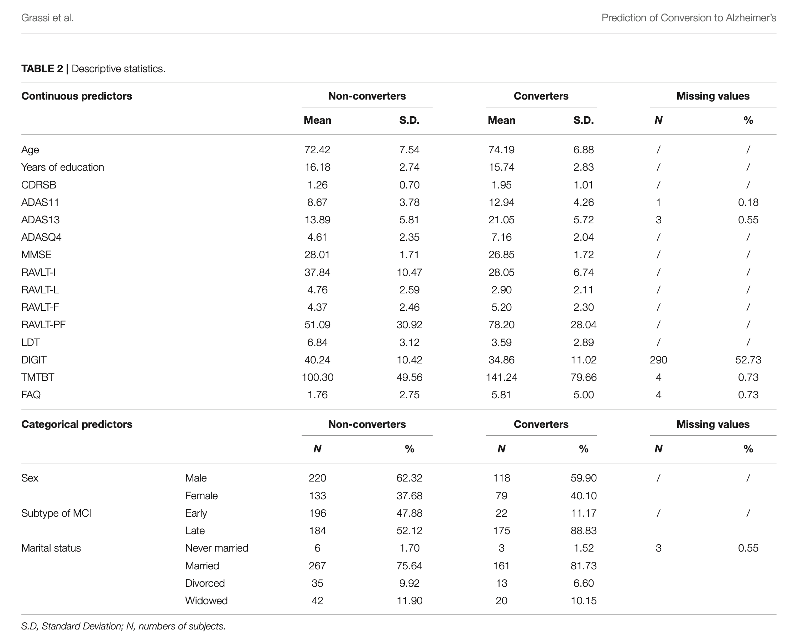

---
title: "Machine Learning predictions in ADNI"
author: "R.G. Thomas"
date: "`r Sys.Date()`"
fontsize: 11pt
output:
  pdf_document:
    number_sections: true
    highlight: tango
    keep_tex: false
latex_engine: xelatex
---

```{r  include=FALSE}
options(knitr.kable.NA = '',dplyr.summarise.inform = FALSE, dplyr.print_max = 1e9)
library(pacman)
p_load(kableExtra, janitor, rmarkdown, tidyverse, knitr)

opts_chunk$set(warning = F, message = F, echo = F, fig.width = 3.2,
       fig.height = 3,  results = "asis", dev = "pdf",
       opts_chunk$set(cache.path = "cache/"))
# Custom helpers replaced with dplyr functions
options(scipen = 1, digits = 2)
```

## Notes

**Goal**: Mimic three ADNI ML papers

- Grassi (2019): Read ADNIMERGE data, subset converters with 3+ years follow-up
- Gill (2020): Neuroimaging + ML
- Dimitriadis (2018): Random Forest approach

**Analysis idea**: Random forest analysis of cognitive data to find enrichment
criteria

# Introduction 
[start with a description of AD and the early stages.
Why are we looking for prediction models? consider NIA intro page] A
diagnosis of Alzheimer's Disease usually only occurs following a long
period, as much as 15 years, of disease progression. 

The length of this prodromal phase differs across individuals.
Identifying those at greatest risk for rapid progression is vital,
both for a clinical and a research perspective.i.e. enrichment. 

Consider the ADNI data archive as a resource for assessing/modeling
progression from MCI -- the earliest stage of observable disease
phenotype -- to AD. The ADNI project was designed by Drs. Leon Thal
and Michael Weiner. Initiated in 2005, the project has 

First key paper is Grassi et al. (2019). First step is to mimic Table 2 in
the paper.



**Other references**:

- Dimitriadis (2018)
- Gill (2020)
- Haulcy (2021)
- Katabathula (2021)

# Methods
```sh

Notes on getting data from ADNI
new password .. see pass find loni

goal 1: mimic Grassi table 2. 
1. determine sample size for adnimerge data set. 
step 1.1: read in ADNIMERGE from ./data directory
> df1 = read.csv("./data/ADNIMERGE.csv")
> dim(df1) # should be greater than 550
>  # looking for 550 subjects with MCI and dx followup for at
>  # least 3 years. 

2. find age mean/sd by coverters

step 2: explore DX variable (see ./data/ADNIMERGE_DICT.csv
and ./data/ADNIMERGE_Methods_21030429.pdf

```


# Results


# Code 
```{r, ref.label=knitr::all_labels(),echo=TRUE,eval=FALSE}
```

# References

```{r cache=F, eval=FALSE}
df <- read.csv("./data/ADNIMERGE.csv", na.strings = "-4") |>
  dplyr::select(RID, VISCODE, ORIGPROT, AGE, MMSE, DX, DX_bl,
                ADAS11, ADAS13, ADASQ4) |>
  rename_with(tolower) |>
  dplyr::filter(dx_bl == "LMCI")

# Filter for those with 3 or more visits
df_cnt <- df |>
  group_by(rid) |>
  dplyr::summarize(N = n()) |>
  dplyr::filter(N >= 3)

df2 <- df |>
  dplyr::filter(rid %in% df_cnt$rid) |>
  arrange(rid, viscode) |>
  group_by(rid)

df3 <- df2 |>
  dplyr::summarize(converter = any(dx == "Dementia"))

# df2 |> tabyl(dx)
# df |> tabyl(origprot)
# df |> tabyl(dx_bl)
# df3 |> tabyl(converter)

foo <- head(df2, 100)
df3foo <- foo |>
  dplyr::summarize(converter = any(dx == "Dementia"))


# tab1adni <- df |>
#   tabyl(race) |>
#   adorn_totals(where = "row")
# tab1adni$race <- sub("\\/", "-", tab1adni$race)
# out <- kbl(tab1adni, booktabs = TRUE, escape = FALSE,
#            caption = "Race categorization for ADNI.") |>
#   kable_paper(latex_options = "striped")

# tab1badni <- df |>
#   tabyl(race, ORIGPROT) |>
#   adorn_totals(where = "row") |>
#   adorn_totals(where = "col")
# tab1badni$race <- sub("\\/", "-", tab1badni$race)
# out <- kbl(tab1badni, booktabs = TRUE, escape = FALSE,
#            caption = "Race categorization for ADNI by protocol.") |>
#   kable_paper(latex_options = "striped") 
dict <- read.csv("./data/ADNIMERGE_DICT.csv", na.strings = "-4") |>
  dplyr::select(FLDNAME, TBLNAME, TEXT, CODE)  


```


